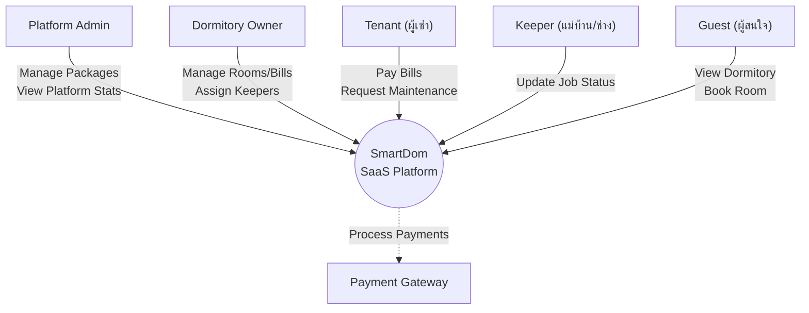
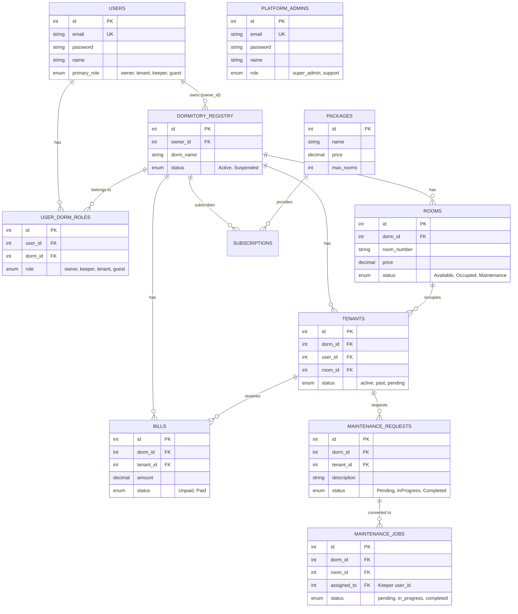
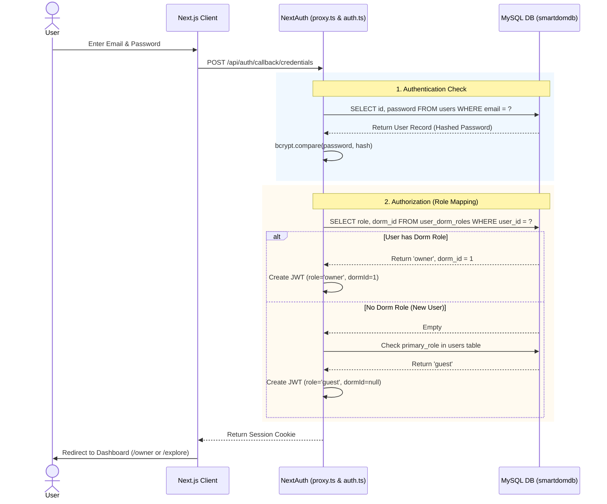
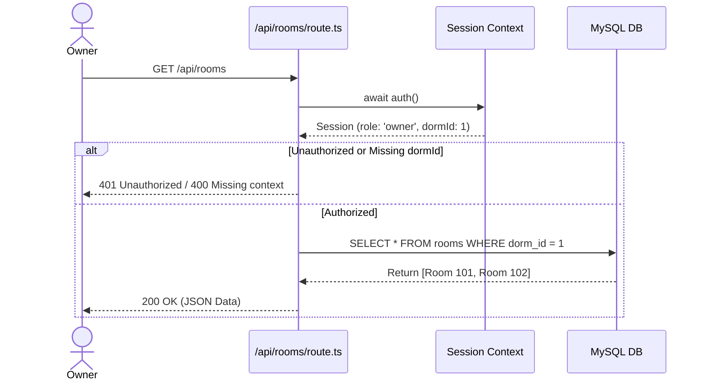

# System Analysis & Diagrams: SmartDom

จากการวิเคราะห์ระบบ SmartDom ทั้งโครงสร้างฐานข้อมูลและตรรกะของโค้ด ผมได้จัดทำไดอะแกรม (Diagrams) ที่สะท้อนถึงการทำงานของระบบในปัจจุบัน โดยใช้ภาษา Mermaid ซึ่งคุณสามารถนำไปอ้างอิงหรือใช้ประกอบรายงานได้ทันทีครับ

---

## 1. Context Diagram
แสดงภาพรวมของระบบและผู้ใช้งานกลุ่มต่างๆ (Actors) ที่เข้ามามีปฏิสัมพันธ์กับ SmartDom System

> [!NOTE]
> ระบบ SmartDom เป็น Multi-tenant SaaS (ซอฟต์แวร์บริการสำหรับหอพัก) ที่ให้เจ้าของหอพักหลายๆ แห่งสามารถเข้ามาใช้ระบบร่วมกันได้ โดยแบ่งแยกสิทธิ์ชัดเจนผ่าน Role-based Access Control (RBAC)

---

## 2. Entity Relationship Diagram (ERD / Relation Diagram)
โครงสร้างของฐานข้อมูล `smartdomdb` แบบ Single-database (รวมทุกหอพักไว้ในฐานข้อมูลเดียว)

> [!TIP]
> สถาปัตยกรรมนี้ใช้ตาราง `user_dorm_roles` เป็นตัวเชื่อมว่า User หนึ่งคนมีบทบาท (Role) อะไรใน `dorm_id` ไหน ทำให้ User 1 คนสามารถเป็นเจ้าของหอพัก A และเป็นผู้เช่าที่หอพัก B ได้พร้อมกันด้วยอีเมลเดียว

---

## 3. Sequence Diagram (Authentication & Authorization Flow)
แสดงขั้นตอนการทำงานเมื่อผู้ใช้งาน (เช่น ผู้เช่าหรือเจ้าของหอพัก) ทำการเข้าสู่ระบบผ่าน API

---

## 4. Sequence Diagram (Data Isolation: Viewing Rooms)
แสดงขั้นตอนที่เจ้าของหอพักพยายามดึงข้อมูลห้องพัก โดยระบบต้องป้องกันไม่ให้ข้อมูลรั่วไหลข้ามหอพัก (Data Isolation)

> [!IMPORTANT]
> ระบบปัจจุบันได้ออกแบบให้ Middleware (`proxy.ts`) ตรวจสอบสิทธิ์ระดับหน้าเว็บ (Route-level) ก่อน ส่วนระดับ API (`/api/...`) จะใช้ตัวแปร `dormId` จาก Session เข้าไปกรอง (Filter) ในคำสั่ง Raw SQL เพื่อบังคับให้ดึงข้อมูลเฉพาะหอพักนั้นๆ เสมอ (Data Isolation)
